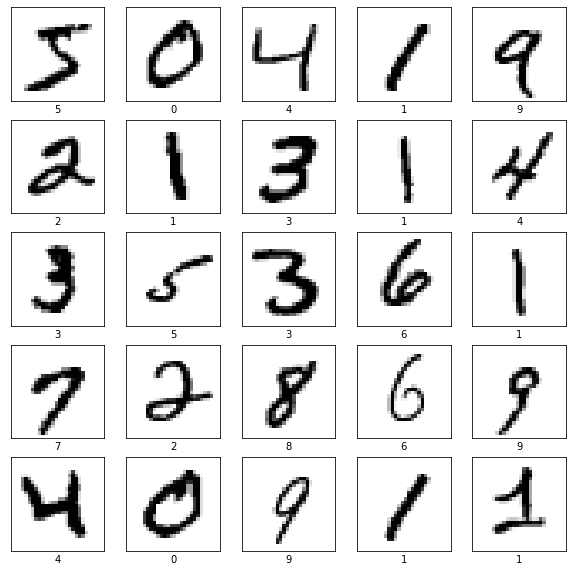
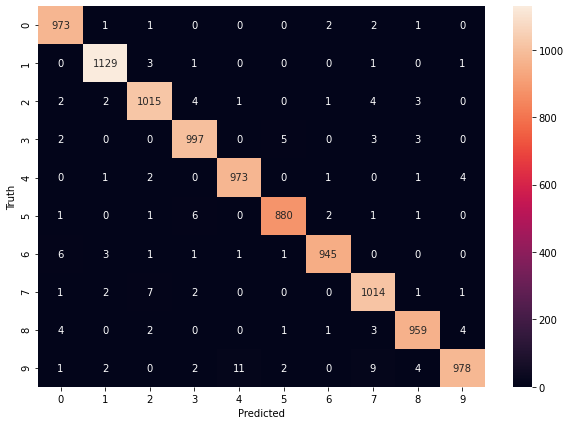

# Classificação de Dígitos Manuscritos

## 💻 Sobre o projeto
Classificação de dígitos manuscritos MNIST usando sklearn e Keras.

## Dataset
 [Dataset MNIST de dígitos manuscritos.](http://yann.lecun.com/exdb/mnist/)

## Requisitos

* linux system (Ubuntu 20.04)
* python 3.8.10 
* matplotlib==3.4.3
* numpy==1.21.4
* pandas==1.3.4
* scikit-learn==1.0.1
* seaborn==0.11.2
* tensorflow==2.7.0

## Modelos

### Keras 01

#### Estrutura

<pre>Model: &quot;sequential&quot;
_________________________________________________________________
Layer (type)                 Output Shape              Param #   
=================================================================
flatten (Flatten)            (None, 784)               0         
_________________________________________________________________
dense (Dense)                (None, 128)               100480    
_________________________________________________________________
dense_1 (Dense)              (None, 10)                1290      
=================================================================
Total params: 101,770
Trainable params: 101,770
Non-trainable params: 0
_________________________________________________________________
None
</pre>

#### Acurácia
    97.71%

#### Matriz de Confusão

### Keras CNN 02

#### Estrutura
<pre>Model: &quot;sequential&quot;
_________________________________________________________________
Layer (type)                 Output Shape              Param #   
=================================================================
conv2d (Conv2D)              (None, 26, 26, 32)        320       
_________________________________________________________________
max_pooling2d (MaxPooling2D) (None, 13, 13, 32)        0         
_________________________________________________________________
flatten (Flatten)            (None, 5408)              0         
_________________________________________________________________
dense (Dense)                (None, 100)               540900    
_________________________________________________________________
dense_1 (Dense)              (None, 10)                1010      
=================================================================
Total params: 542,230
Trainable params: 542,230
Non-trainable params: 0
_________________________________________________________________
None
</pre>

#### Acurácia
    98.62%

#### Matriz de Confusão

### Sklearn KNN

#### Acurácia
    96.88%

#### Matriz de Confusão

## [Notebooks](./notebooks)

## [Exemplos](./notebooks/07_examples.ipynb)

## Referências
* Tensorflow: https://www.tensorflow.org/tutorials/keras/classification
* Sklearn: https://scikit-learn.org/stable/
